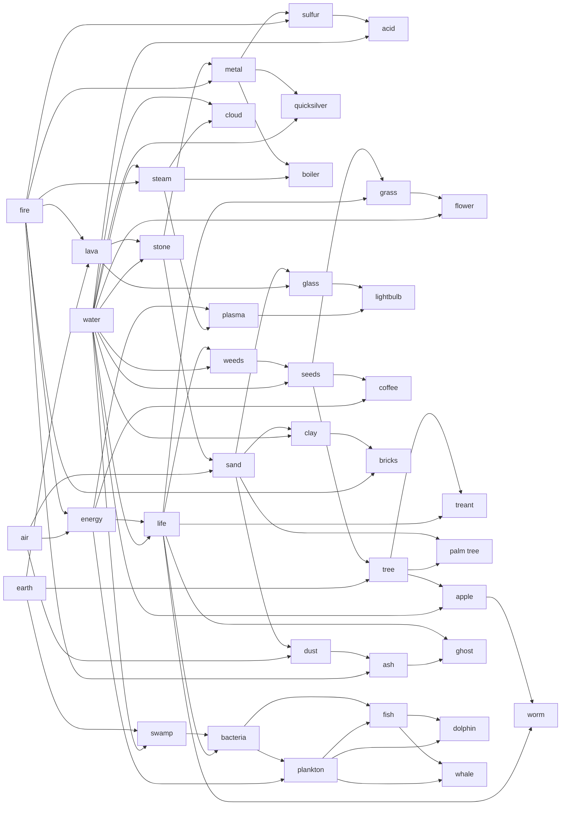

# Doodle God Universe Reactions

```mermaid
graph LR

sulfur -->  acid
water --> acid

seeds --> tree
earth --> tree

grass --> flower
water --> flower

seeds --> grass
life --> grass

weeds --> seeds
water --> seeds

life --> weeds
water --> weeds

energy --> life
water --> life

energy --> plasma
steam --> plasma

fire --> energy
air --> energy

metal --> sulfur
fire --> sulfur

metal --> quicksilver
water --> quicksilver

metal --> boiler
steam --> boiler

stone --> metal
fire --> metal

lava --> stone
water --> stone

water --> cloud
steam --> cloud

earth --> swamp
water --> swamp

water --> steam
fire --> steam

fire --> lava
earth --> lava

tree --> treant
life --> treant

stone --> sand
air --> sand

sand --> glass
lava --> glass

sand --> dust
air --> dust

glass --> lightbulb
plasma --> lightbulb

seeds --> coffee
energy --> coffee

sand --> palmtree[palm tree]
tree --> palmtree[palm tree]

sand --> clay
water --> clay

clay --> bricks
fire --> bricks

dust --> ash
fire --> ash

tree --> apple
water --> apple

apple --> worm
life --> worm

life --> ghost
ash --> ghost

swamp --> bacteria
life --> bacteria

bacteria --> plankton
energy --> plankton

bacteria --> fish
plankton --> fish

fish --> dolphin
plankton --> dolphin

fish --> whale
plankton --> whale
```
