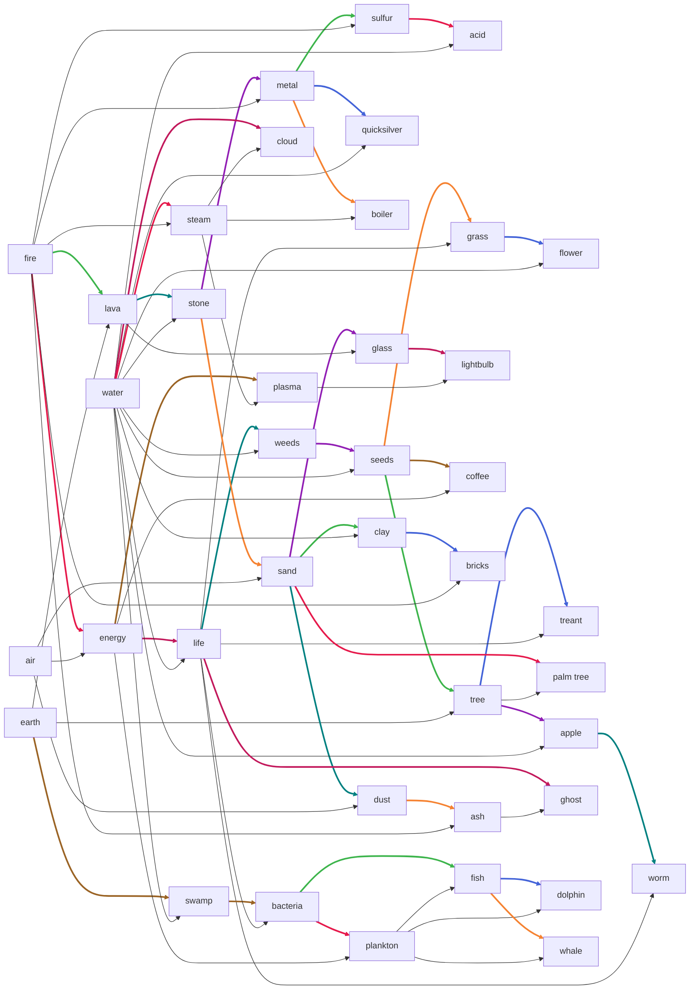

# Doodle God Universe Reactions

```mermaid
graph LR

sulfur -->  acid
water --> acid

seeds --> tree
earth --> tree

grass --> flower
water --> flower

seeds --> grass
life --> grass

weeds --> seeds
water --> seeds

life --> weeds
water --> weeds

energy --> life
water --> life

energy --> plasma
steam --> plasma

fire --> energy
air --> energy

metal --> sulfur
fire --> sulfur

metal --> quicksilver
water --> quicksilver

metal --> boiler
steam --> boiler

stone --> metal
fire --> metal

lava --> stone
water --> stone

water --> cloud
steam --> cloud

earth --> swamp
water --> swamp

water --> steam
fire --> steam

fire --> lava
earth --> lava

tree --> treant
life --> treant

stone --> sand
air --> sand

sand --> glass
lava --> glass

sand --> dust
air --> dust

glass --> lightbulb
plasma --> lightbulb

seeds --> coffee
energy --> coffee

sand --> palmtree[palm tree]
tree --> palmtree[palm tree]

sand --> clay
water --> clay

clay --> bricks
fire --> bricks

dust --> ash
fire --> ash

tree --> apple
water --> apple

apple --> worm
life --> worm

life --> ghost
ash --> ghost

swamp --> bacteria
life --> bacteria

bacteria --> plankton
energy --> plankton

bacteria --> fish
plankton --> fish

fish --> dolphin
plankton --> dolphin

fish --> whale
plankton --> whale

linkStyle 0 stroke:#e6194b,stroke-width:3px
linkStyle 2 stroke:#3cb44b,stroke-width:3px
linkStyle 4 stroke:#4363d8,stroke-width:3px
linkStyle 6 stroke:#f58231,stroke-width:3px
linkStyle 8 stroke:#911eb4,stroke-width:3px
linkStyle 10 stroke:#008080,stroke-width:3px
linkStyle 12 stroke:#c2185b,stroke-width:3px
linkStyle 14 stroke:#9a6324,stroke-width:3px
linkStyle 16 stroke:#e6194b,stroke-width:3px
linkStyle 18 stroke:#3cb44b,stroke-width:3px
linkStyle 20 stroke:#4363d8,stroke-width:3px
linkStyle 22 stroke:#f58231,stroke-width:3px
linkStyle 24 stroke:#911eb4,stroke-width:3px
linkStyle 26 stroke:#008080,stroke-width:3px
linkStyle 28 stroke:#c2185b,stroke-width:3px
linkStyle 30 stroke:#9a6324,stroke-width:3px
linkStyle 32 stroke:#e6194b,stroke-width:3px
linkStyle 34 stroke:#3cb44b,stroke-width:3px
linkStyle 36 stroke:#4363d8,stroke-width:3px
linkStyle 38 stroke:#f58231,stroke-width:3px
linkStyle 40 stroke:#911eb4,stroke-width:3px
linkStyle 42 stroke:#008080,stroke-width:3px
linkStyle 44 stroke:#c2185b,stroke-width:3px
linkStyle 46 stroke:#9a6324,stroke-width:3px
linkStyle 48 stroke:#e6194b,stroke-width:3px
linkStyle 50 stroke:#3cb44b,stroke-width:3px
linkStyle 52 stroke:#4363d8,stroke-width:3px
linkStyle 54 stroke:#f58231,stroke-width:3px
linkStyle 56 stroke:#911eb4,stroke-width:3px
linkStyle 58 stroke:#008080,stroke-width:3px
linkStyle 60 stroke:#c2185b,stroke-width:3px
linkStyle 62 stroke:#9a6324,stroke-width:3px
linkStyle 64 stroke:#e6194b,stroke-width:3px
linkStyle 66 stroke:#3cb44b,stroke-width:3px
linkStyle 68 stroke:#4363d8,stroke-width:3px
linkStyle 70 stroke:#f58231,stroke-width:3px
```
